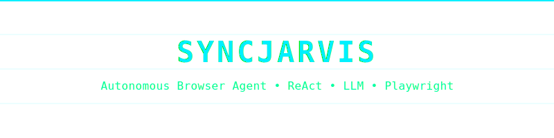

<p align="center">
  
</p>

<p align="center">
  
  
  
</p>

<p align="center">
  
  
  
</p>

<p align="center">
  
  
  
</p>

<p align="center">
  
  
</p>

<p align="center">
  
  
  
</p>


---

# SyncJarvis

**SyncJarvis** - автономный ReAct-агент для управления браузером через **Playwright** и LLM (**OpenRouter**). Точка входа: `app.py` (`load_dotenv`, `load_app_settings`, `run_console_session` в `agent/cli/session.py`). План и лимиты сессии - **`TaskOrchestrator`** (`agent/runtime/orchestrator.py`); шаги внутри подзадачи - **`SubtaskReActLoop`** (`agent/runtime/react_loop/loop.py`) и **`run_subtask_pipeline`** в `agent/runtime/react_loop/engine/pipeline.py` плюс фазы в `agent/runtime/react_loop/engine/phases/`.

## Почему SyncJarvis

- **Viewport-first fusion** - актёр получает снимок viewport и компактный a11y-контекст (`agent/runtime/react_loop/components/fusion_step_snapshot.py`, `ActorLLMClient.decide_fusion_step_action` в `agent/llm/clients/actor.py`). См. `agent/runtime/ARCHITECTURE.md` и `agent/llm/ARCHITECTURE.md`.
- **A11y вместо CSS/XPath** - интерактивные элементы из дерева доступности: `agent/perception/accessibility.py`.
- **ModelRouter** - чередование **cheap** / **smart**: `agent/llm/services/router.py`; модели задаются переменными `OPENROUTER_MODEL_*`.
- **Учёт стоимости** - `RunCostStats` в `agent/runtime/react_loop/config.py`, регистрация через `register` по тиру и токенам.
- **Защита по слоям** - self-check подзадачи, crop-verify перед click/type на smart-тире, опциональный goal verify, пауза на опасные действия (см. раздел ниже).

## Demo Video

[Я.Диск: https://disk.yandex.ru/i/ARHtsW7q1BH24Q]

[Я.Диск: https://disk.yandex.ru/i/2bXceiE1n1gvoA] <---- Голосовое управление # 1

[Я.Диск: https://disk.yandex.ru/i/nq8V2sA9KBw4yg] <---- Голосовое управление # 2

## Архитектура и поток данных

Один шаг цикла подзадачи в порядке вызова из `run_subtask_pipeline`:


### Роли верхнего уровня

- **`TaskOrchestrator`** - `agent/runtime/orchestrator.py`: план подзадач, политики, паузы на подтверждение, опционально `goal_verifier`.
- **`SubtaskReActLoop`** - `agent/runtime/react_loop/loop.py`: инициализация актёра и роутера, вызов пайплайна.
- **Фазы** - `agent/runtime/react_loop/engine/phases/`: возврат `PhaseStepResult` (`proceed` / `next_iteration` / `halt`).
- **LLM-слой** - `agent/llm/`: клиенты, промпты, парсинг, контракты (без циклического импорта из runtime).

## Быстрый старт

```bash
python3 -m venv .venv
source .venv/bin/activate
pip install -r requirements.txt
playwright install chromium
cp .env.example .env
```

В `.env` задайте **`OPENROUTER_API_KEY`** (без ключа `app.py` завершится с `RuntimeError`).

```bash
python app.py
```

Зависимости из `requirements.txt`: `openai`, `playwright`, `pydantic`, `python-dotenv`, `rich`.

## Voice Mode (Demo)

`Voice Mode` позволяет запускать задачу голосом и получать короткие голосовые подсказки по ходу выполнения.

### Как включить

Добавьте/проверьте в `.env`:

```env
AGENT_VOICE_MODE=true
AGENT_VOICE_WAKEWORD=hey_jarvis
AGENT_VOICE_ACTIVATION_THRESHOLD=0.3
AGENT_VOICE_SAMPLE_RATE=16000
AGENT_VOICE_BLOCK_SIZE=1280
AGENT_VOICE_RECORD_SECONDS=5.0
AGENT_VOICE_MIN_WORDS=4
```

### Как это работает

1. Запускаете `python app.py`.
2. В `voice_mode` агент слушает wakeword (`hey jarvis`).
3. После активации записывается голосовая команда пользователя.
4. Команда превращается в текст и передаётся в оркестратор как `user_goal`.
5. Во время выполнения агент озвучивает:
   - старт этапа плана;
   - выбранные действия (кратко);
   - итог успешного выполнения (по секции «Итог» из final report).

### Замечания

- Если команда слишком короткая (меньше `AGENT_VOICE_MIN_WORDS`), агент попросит повторить.
- Для более надёжного детекта wakeword можно повысить `AGENT_VOICE_ACTIVATION_THRESHOLD` (например, до `0.4-0.6`).
- Для длинных команд увеличьте `AGENT_VOICE_RECORD_SECONDS`.

## Конфигурация

Переменные читаются из окружения в `agent/config/settings.py`; образец - `.env.example`. Если не заданы **cheap** и **smart**, используется **`OPENROUTER_MODEL`**.

Размер **layout viewport** Chromium (то, под какую ширину/высоту отрабатывает адаптивная вёрстка сайта) задаётся **`AGENT_BROWSER_VIEWPORT_WIDTH`** и **`AGENT_BROWSER_VIEWPORT_HEIGHT`** и прокидывается в `BrowserToolExecutor` из `agent/cli/session.py`, далее в `agent/tools/browser_executor/lifecycle.py` при `launch_persistent_context` и при создании пустого контекста по CDP.

### Основные переменные

| Переменная | Описание |
|------------|----------|
| `OPENROUTER_API_KEY` | Ключ OpenRouter (обязателен). |
| `OPENROUTER_MODEL` | Fallback-модель при отсутствии cheap/smart. |
| `OPENROUTER_MODEL_CHEAP` | Модель тира cheap в **ModelRouter**. |
| `OPENROUTER_MODEL_SMART` | Модель тира smart при эскалации. |
| `AGENT_MAX_SUBTASK_STEPS` | Лимит шагов ReAct на одну подзадачу. |
| `AGENT_SMART_COOLDOWN_STEPS` | Интервал до повторного smart после smart. |

<details>
<summary><b>Полный список параметров (.env.example)</b></summary>

| Переменная | Назначение |
|------------|------------|
| `AGENT_MAX_TOTAL_STEPS` | Лимит шагов на всю задачу в оркестраторе. |
| `AGENT_PLANNER_MAX_SUBTASKS` | Верхняя граница числа подзадач в плане (1-50). |
| `AGENT_PLANNER_TEMPERATURE` | Температура LLM-планировщика (JSON-план). |
| `AGENT_PROMPT_MAX_OBSERVATION_ITEMS` | Лимит элементов наблюдения в промпте актёра. |
| `AGENT_PROMPT_MAX_TEXT_FIELD_LEN` | Лимит длины текстовых полей в наблюдении. |
| `AGENT_ACTOR_RESPONSE_MAX_TOKENS` | Максимум токенов ответа актёра. |
| `AGENT_CAPTCHA_MAX_CONSECUTIVE_WAIT` | Порог подряд итераций капчи до `BLOCKED_CAPTCHA`. |
| `AGENT_LLM_TRANSPORT_MAX_RETRIES` | Повторы транспорта при сети / 5xx (не при ошибке парсинга JSON действия). |
| `AGENT_GOAL_VERIFY_LLM` | Финальная LLM-проверка пользовательской цели после плана. |
| `AGENT_GOAL_VERIFY_FAIL_SOFT` | Поведение при `satisfied=false` у verify (см. комментарий в `.env.example`). |
| `AGENT_CONTINUE_AFTER_SUBTASK_LIMIT` | Продолжать план при лимите шагов подзадачи. |
| `AGENT_BROWSER_HEADLESS` | `true` - Chromium без окна. |
| `AGENT_BROWSER_VIEWPORT_WIDTH` | Ширина layout viewport (px), по умолчанию 1440, clamp 320-3840 в `load_app_settings`. |
| `AGENT_BROWSER_VIEWPORT_HEIGHT` | Высота layout viewport (px), по умолчанию 900, clamp 240-2160. |
| `AGENT_SUBTASK_GOAL_SELF_CHECK_LLM` | Микро self-check цели подзадачи (`self_check_phase.py`). |
| `AGENT_OBSERVATION_FUSION_MULTIMODAL` | Читается в настройках; ветвление «только текст» в оркестраторе не используется - см. `agent/runtime/ARCHITECTURE.md`. |
| `AGENT_PRICE_DEFAULT_INPUT_PER_1M` | Оценка USD / 1M input, тир default. |
| `AGENT_PRICE_DEFAULT_OUTPUT_PER_1M` | Оценка USD / 1M output, тир default. |
| `AGENT_PRICE_CHEAP_INPUT_PER_1M` | Оценка USD / 1M input для cheap. |
| `AGENT_PRICE_CHEAP_OUTPUT_PER_1M` | Оценка USD / 1M output для cheap. |
| `AGENT_PRICE_SMART_INPUT_PER_1M` | Оценка USD / 1M input для smart. |
| `AGENT_PRICE_SMART_OUTPUT_PER_1M` | Оценка USD / 1M output для smart. |
| `OPENROUTER_HTTP_REFERER` | Опционально для OpenRouter. |
| `OPENROUTER_X_TITLE` | Опционально для OpenRouter. |

В комментариях `.env.example` также фигурируют **`AGENT_BROWSER_CDP_URL`** и устаревший **`AGENT_USE_LLM_PLANNER`** (игнорируется). Другие ключи (например **`AGENT_GROUNDING_*`**, **`AGENT_BROWSER_NAVIGATE_*`**) см. в `load_app_settings()` в `agent/config/settings.py`.

</details>

## Безопасность и надёжность

### Self-check и goal verify

- При **`AGENT_SUBTASK_GOAL_SELF_CHECK_LLM=true`** после подходящего шага: **`assess_goal_reached`** и снимок из **`goal_self_check_snapshot`** (фаза `self_check_phase.py`, шаблоны в `agent/llm/prompts/templates.py`).
- При **`AGENT_GOAL_VERIFY_LLM=true`**: **`verify_user_goal_satisfied_llm`** в `agent/runtime/goal_verifier.py`, кадр в `history/verify_user_goal.png`; при ошибке сети или невалидном JSON успех не подтверждается.

### Crop-verify

В **`execute_phase.py`** вызывается **`maybe_verify_click_type_crop`** (`crop_action_verify.py`): для **click** / **type** на **smart**-тире — кроп вокруг bbox и ответ LLM YES/NO; при NO шаг откатывается, итерация повторяется без клика.

### Опасные действия, анти-зацикливание и ожидание ручных действий

- **`is_confirmation_required`** в `agent/runtime/security.py`, **`dangerous_guard.py`**, состояние **`AWAITING_USER_CONFIRMATION`** в `agent/cli/session.py`, **`resume_after_dangerous_confirmation`** в `orchestrator.py`.
- Восстановление при застревании / поиске: **`vision_recovery_phase`** и связанные компоненты в `agent/runtime/react_loop/components/` (см. код фазы и `memory`).
- Если агент сталкивается с задачей, которую не способен решить сам (например, капча или иное требующее человеческого вмешательства действие), происходит автоматическое ожидание пользовательского решения. Капча распознаётся в поведении пайплайна (например, статус BLOCKED_CAPTCHA при превышении лимита `AGENT_CAPTCHA_MAX_CONSECUTIVE_WAIT`), после чего агент ждёт действий пользователя или определённое время, чтобы возобновить выполнение.

## Для разработчиков

- [Runtime Architecture](agent/runtime/ARCHITECTURE.md) - оркестратор, viewport-first, pipeline и фазы, метрики, история.
- [LLM & Prompts Logic](agent/llm/ARCHITECTURE.md) - планировщик, актёр, **ModelRouter**, парсинг, контракты.

## Структура репозитория

```text
SyncJarvis/
├── app.py
├── requirements.txt
├── .env.example
├── agent/
│   ├── cli/                 # run_console_session, вывод в консоль
│   ├── config/              # load_app_settings, AppSettings
│   ├── logging/             # HistoryLogger
│   ├── llm/                 # clients, services, prompts, contracts, ARCHITECTURE.md
│   ├── models/              # task, plan, action, observation, state, telemetry, log
│   ├── perception/          # accessibility-сбор элементов страницы
│   ├── planner/             # intent_classifier, plan_builder, plan_schema, plan_normalizer
│   ├── policies/            # режимы подзадач, anti_loop_guard и др.
│   ├── runtime/
│   │   ├── ARCHITECTURE.md
│   │   ├── orchestrator.py
│   │   ├── memory.py
│   │   ├── goal_verifier.py
│   │   ├── security.py
│   │   ├── anti_loop.py
│   │   ├── self_correction.py
│   │   └── react_loop/
│   │       ├── loop.py
│   │       ├── config.py    # LoopConfig, RunCostStats
│   │       ├── engine/
│   │       │   ├── pipeline.py
│   │       │   ├── decision_maker.py
│   │       │   ├── action_executor.py
│   │       │   ├── types.py
│   │       │   └── phases/  # observation, self_check, grounding, vision_recovery, llm_decision, execute, persist_metrics
│   │       ├── components/  # fusion_step_snapshot, goal_self_check_snapshot, captcha, vision_recovery, crop_action_verify, ...
│   │       ├── utils/       # observation_builder, telemetry, persistence
│   │       └── observability/
│   └── tools/
│       └── browser_executor/  # Playwright: executor, dispatch, guards
└── tests/
```
