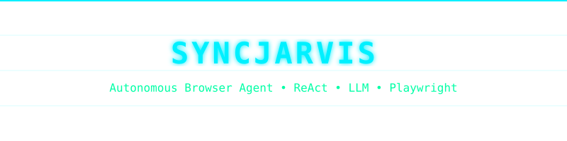
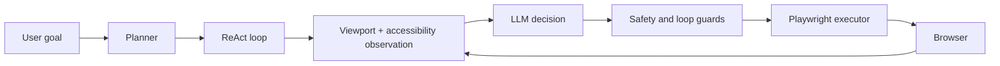

<p align="center">
  
</p>

# SyncJarvis

Browser automation agent with safety controls and LLM-guided planning.

SyncJarvis is an experimental Python project that combines Playwright, viewport screenshots, and accessibility-tree grounding to carry out multi-step browser tasks. It is designed for supervised experimentation: actions marked as dangerous require user confirmation.

## What it does

- Builds a short task plan and executes it through a ReAct loop.
- Grounds decisions in both the visible browser viewport and the accessibility tree instead of brittle CSS or XPath selectors.
- Routes routine and escalated decisions to configurable cheap and smart model tiers while recording token-based cost estimates.
- Stops for user input when a CAPTCHA, a confirmation gate, or another manual-only step is encountered.
- Supports optional voice input for local sessions.

## Key engineering decisions

- **Viewport-first grounding.** The actor sees the current screenshot and a compact accessibility context, reducing reliance on opaque DOM selectors.
- **Explicit execution phases.** Observation, self-check, recovery, decision, execution, and persistence are separated to keep the ReAct loop reviewable.
- **Guarded actions.** Confirmation gates, anti-loop checks, retries, step limits, and state transitions are part of normal execution rather than afterthoughts.
- **Cost-aware routing.** Model tiers are selected by runtime conditions and their usage is tracked.

## Architecture


```mermaid
flowchart LR
    U[User goal] --> P[Planner]
    P --> R[ReAct loop]
    R --> O[Viewport + accessibility observation]
    O --> D[LLM decision]
    D --> G[Safety and loop guards]
    G --> E[Playwright executor]
    E --> W[Browser]
    W --> O
```

See [architecture](docs/architecture.md) for component boundaries, contracts, and state transitions.

## Quick start

Requirements: Python 3.12+ and a local Chromium installation supported by Playwright.

```bash
git clone https://github.com/pelehatyjvadim0/SyncJarvis.git
cd SyncJarvis
python3 -m venv .venv
source .venv/bin/activate
pip install -r requirements.txt
playwright install chromium
cp .env.example .env
```

Set `OPENROUTER_API_KEY` in `.env`, choose model identifiers if needed, then start a local console session:

```bash
python app.py
```

Use a non-production browser profile and test only on accounts and sites you are authorized to use.

## Demo

The reproducible, safe local demo uses a fixture page with an in-viewport control and a below-the-fold control. Follow [the demo guide](docs/demo.md) before recording or sharing a public demo. Do not use authenticated sessions, customer data, or real purchase flows in recordings.

Additional demonstration recordings:

- [Browser-agent walkthrough](https://disk.yandex.ru/i/ARHtsW7q1BH24Q)
- [Voice control demo — part 1](https://disk.yandex.ru/i/2bXceiE1n1gvoA)
- [Voice control demo — part 2](https://disk.yandex.ru/i/nq8V2sA9KBw4yg)

## Safety model

Actions marked as dangerous require confirmation. The agent does not claim to solve or bypass CAPTCHAs: it detects likely CAPTCHA or manual-intervention states and pauses the task for the user. Read the full [safety model](docs/safety-model.md) before use.

## Configuration

Copy `.env.example` to `.env`; never commit `.env`. The configuration reference groups the required model settings, execution limits, browser settings, and optional cost controls: [configuration](docs/configuration.md).

## Limitations

- This is an experimental browser agent, not a guaranteed workflow automation system.
- Web pages change, accessibility metadata can be incomplete, and LLM output can be incorrect.
- Network failures, CAPTCHAs, login walls, and browser-specific behavior can block a task.
- Confirmation reduces risk but does not remove the need for human review.

## Development

```bash
python -m ruff check agent tests
python -m compileall -q agent
python -m pytest -q
```

Run the checks before opening a pull request or recording a public demo.

## License

Distributed under the [MIT License](LICENSE).
